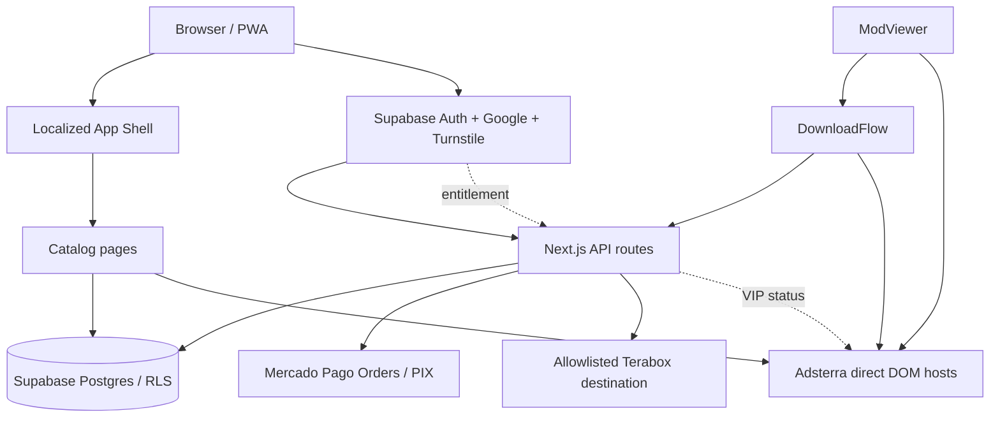
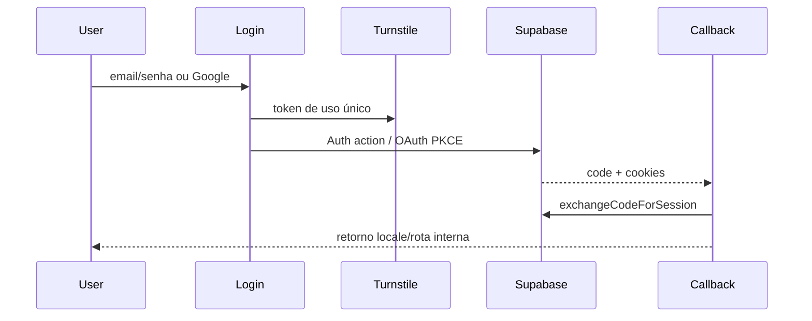
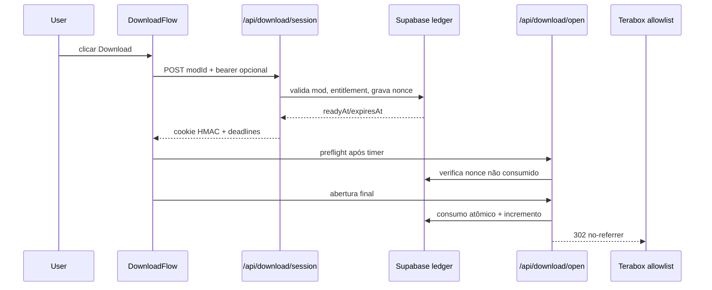
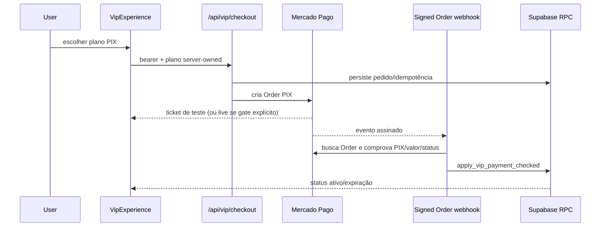

# Codebase Map

> Mapa consolidado pelo Cartographer. Último mapeamento: 2026-09-19T13:56:17Z.
> A contagem exata de tokens não pôde usar o scanner online neste ambiente; o valor acima é uma estimativa por caracteres.

## Visão geral

O GuizzMods é um site Next.js 16 (App Router) com React 19, páginas localizadas em inglês, português e espanhol, catálogo público no Supabase e área administrativa protegida. O fluxo de monetização usa Mercado Pago Orders com PIX; o checkout real permanece desativado por uma chave de segurança. Anúncios Adsterra são montados apenas para visitantes sem entitlement VIP.



## Estrutura de diretórios

```text
src/
  app/[locale]/       páginas públicas, admin e telas localizadas
  app/api/             endpoints server-only de catálogo, auth, download e VIP
  app/auth/            callback PKCE do Supabase
  components/          UI compartilhada e fluxos client-side
  lib/                 regras de negócio, validação, provider e Supabase
  messages/            traduções en/es/pt
  i18n/                routing e carregamento de locale
  proxy.ts             middleware/proxy de locale e sessão
supabase/migrations/   views, RLS, funções, pedidos VIP e ledger de downloads
tests/                  testes unitários isolados, smoke e ciclos de UI
docs/                   decisões operacionais e este mapa
.work/                  continuidade entre sessões e agentes
public/                 manifest, ícones, robots e ads.txt
```

## Guia de módulos

### Shell, navegação e localização

| Arquivo | Responsabilidade |
|---|---|
| `src/app/[locale]/layout.tsx` | Shell, metadata, navegação, analytics e gate de anúncios |
| `src/app/[locale]/globals.css` | Base visual e tokens globais |
| `src/app/[locale]/site-motion.css` | Transições de rota/cartões com reduced motion |
| `src/components/TopHeader.tsx` | Cabeçalho desktop, CTA VIP e conta |
| `src/components/MobileNav.tsx` | Navegação inferior responsiva |
| `src/components/SiteFooter.tsx` | Links institucionais e confiança |
| `src/i18n/routing.ts` / `request.ts` | Locales suportados e carregamento de mensagens |
| `src/messages/{en,es,pt}.json` | Texto de todas as telas; as chaves devem permanecer alinhadas |

### Catálogo e administração

| Arquivo | Responsabilidade |
|---|---|
| `src/app/[locale]/page.tsx` | Home com trilhos limitados de novidades por categoria |
| `src/app/[locale]/category/[slug]/page.tsx` | Categoria paginada, filtros e anúncio a cada 10 itens |
| `src/app/[locale]/search/page.tsx` | Busca com anúncio in-feed a cada 8 resultados no mobile; desktop usa as laterais |
| `src/app/[locale]/search/page.tsx` | Busca server-side/client-side com proteção contra respostas obsoletas |
| `src/app/[locale]/favorites/page.tsx` | Favoritos autenticados |
| `src/app/[locale]/upload/page.tsx` | CRUD, importação/exportação CSV e subcategorias admin |
| `src/components/ModCard.tsx` / `CategoryBadges.tsx` | Cartões e badges principal/secundário |
| `src/components/ModViewer.tsx` | Página individual, ratings, relacionados e DownloadFlow |
| `src/app/api/admin/mods/route.ts` | CRUD admin com autorização, limites de corpo e erros genéricos |
| `src/app/api/admin/minecraft/route.ts` | Importação autenticada de metadados do Marketplace oficial |
| `src/app/api/cron/sync-minecraft/route.ts` | Sincronização diária bounded de itens importados, protegida por `CRON_SECRET` |
| `src/app/api/mods/[id]/refresh/route.ts` | Atualização pública sob cooldown ao abrir um item importado; falhas viram atenção administrativa |
| `src/app/api/admin/status/route.ts` | Verificação de acesso administrativo |
| `src/app/api/health/route.ts` | Sonda pública de liveness, sem cache e sem dependências |
| `src/lib/admin-auth.ts` / `catalog-csv.ts` | Autorização e exportação segura |
| `src/lib/minecraft-marketplace.ts` | Validação do domínio, API oficial do catálogo, parser JSON-LD/HTML e extração de mídia |

### Autenticação e conta

| Arquivo | Responsabilidade |
|---|---|
| `src/app/[locale]/login/page.tsx` | Login, cadastro, recuperação, Google e cooldown de email |
| `src/components/AuthCaptcha.tsx` | Turnstile de uso único; o segredo nunca chega ao navegador |
| `src/app/auth/callback/route.ts` | Troca PKCE, cookies atuais, locale/retorno allowlisted e no-store |
| `src/app/[locale]/settings/page.tsx` | Perfil, senha, logout e card de entitlement VIP |
| `src/app/[locale]/login/update-password/page.tsx` | Atualização segura após recuperação |
| `src/lib/auth-actions.ts` | Normaliza entradas, adapta erros do Supabase para mensagens genéricas e executa ações OAuth |
| `src/lib/auth-return.ts` | Permite apenas retornos internos conhecidos |
| `docs/auth-rollout.md` | Checklist do rollout Google/Turnstile/Resend |

### VIP e pagamentos

| Arquivo | Responsabilidade |
|---|---|
| `src/app/[locale]/vip/page.tsx` | Página pública de planos e CTA |
| `src/components/VipExperience.tsx` | Entitlement, retorno de login e checkout PIX |
| `src/components/VipAdGate.tsx` | Resolve sessão/entitlement antes de montar anúncios |
| `src/lib/vip-plans.ts` / `vip-copy.ts` | Planos, preços, períodos e textos localizados |
| `src/lib/mercadopago-checkout.ts` | Orders PIX, idempotência, origem e gates test/live |
| `src/lib/mercadopago-webhook.ts` | Assinatura, status, valores liquidados e prova de PIX |
| `src/lib/vip-orders.ts` | Persistência de pedido e prevenção de duplicidade |
| `src/lib/vip-entitlement.ts` | Status ativo e recuperação limitada de webhook perdido |
| `src/app/api/vip/checkout/route.ts` | POST autenticado, plano server-owned e resposta sem segredos |
| `src/app/api/vip/status/route.ts` | Entitlement público mínimo, sempre `no-store` |
| `src/app/api/vip/webhook/mercadopago/route.ts` | Webhook Order assinado, idempotente e fail-closed |
| `src/app/api/admin/vip/reconcile/route.ts` | Reconciliação admin limitada, PIX-only e deadline global |
| `docs/mercadopago-payments.md` | Operação de Sandbox/Production e gates |

### Downloads protegidos e anúncios

| Arquivo | Responsabilidade |
|---|---|
| `src/components/DownloadFlow.tsx` | Sessão, etapas temporizadas, retorno de aba e abertura final |
| `src/components/DownloadFlowView.tsx` | Apresentação, CTA VIP e anúncios no fluxo |
| `src/lib/download-access.ts` | Token HMAC, cookies por mod e shape validation |
| `src/lib/download-url.ts` | Allowlist de destinos Terabox |
| `src/app/api/download/session/route.ts` | Sessão assinada, nonce privado e TTL VIP/normal |
| `src/app/api/download/open/route.ts` | Preflight, CSRF/fetch metadata, consumo atômico e redirect no-referrer |
| `src/components/AdPlaceholder.tsx` | Ambiente de desenvolvimento e gate VIP para anúncios |
| `src/components/AdsterraSidebar.tsx` | Hosts DOM diretos por formato/viewport; `invoke.js` cria o iframe do provedor |
| `src/components/AdblockGuard.tsx` | Aviso best-effort; jamais autoriza download |

### Dados e migrations

| Migration | Papel |
|---|---|
| `20260830_01_create_public_mods_view.sql` | View pública com colunas seguras |
| `20260830_02_lock_private_mods.sql` | Bloqueio de tabela privada |
| `20260906_03_public_catalog_invoker.sql` | RLS/invoker para catálogo |
| `20260916_04_vip_payments.sql` | Pedidos, eventos, entitlements e RPC base |
| `20260916_05_harden_public_functions.sql` | Search path fixo e revogação de EXECUTE público |
| `20260917_01_prevent_duplicate_vip_orders.sql` | Índice parcial contra pedidos abertos duplicados |
| `20260917_02_bind_provider_checkout.sql` | RPC checked com vínculo de provider |
| `20260917_03_one_time_download_sessions.sql` | Ledger privado de nonces de download |
| `20260920_06_minecraft_marketplace_sources.sql` | Origem privada e relógio de sincronização dos itens importados |

## Fluxos de dados críticos

### Login e Google



### Download protegido



### Checkout e entitlement



## Convenções

- Toda superfície pública deve ser bounded: catálogo 10/20/50, bodies pequenos, reconciliação limitada.
- Supabase browser usa apenas a chave pública; `service_role` fica em módulos server-only e variáveis secretas.
- Entitlement, preço, plano, destino de download e origem são decididos no servidor.
- Erros exibidos ao usuário são localizados e genéricos; detalhes ficam apenas em logs seguros.
- Rotas dinâmicas usam `no-store` quando carregam sessão, token, pagamento ou entitlement.
- Alterações visuais devem respeitar `prefers-reduced-motion`, pointer fino e mobile.
- Mudanças publicáveis devem ser agrupadas em lote coeso, validadas, commitadas e só então enviadas ao Vercel.

## Atualização de navegação, ads e desempenho — 2026-09-19

- `ModViewer.tsx` concentra a hierarquia do detalhe e mantém cinco posições: quatro leaderboards responsivos e o quadrado de Technical Specifications.
- `AdPlaceholder.tsx` continua sendo o shell único; `AdsterraSidebar.tsx` continua sendo o dono de formatos, dimensões e montagem direta no DOM.
- As últimas mudanças publicadas centralizaram o resumo também no desktop; a verificação pública mostrou os slots horizontais e o quadrado correto.
- A linha de base PageSpeed é forte no desktop (95) e precisa de foco no celular (68), principalmente CLS 0,312, LCP 4,0 s e Speed Index 4,8 s.
- O plano de implementação por lotes, com as referências TikTok e os critérios de aceite, está em [docs/LAUNCH_MAP.md](LAUNCH_MAP.md).
- O diagnóstico Lote 0 confirmou que `/llms.txt` cai no fallback HTML localizado e que os slots inline de anúncio só recebem dimensão após `ResizeObserver`; consulte [docs/DIAGNOSTIC_LOTE0_2026-09-19.md](DIAGNOSTIC_LOTE0_2026-09-19.md) antes de editar.
- A home agora usa `HOME_MOD_FIELDS` e inicia leituras latest/trending/categoria em paralelo; a confirmação quantitativa depende de nova medição PageSpeed após deploy.

## Lacunas e riscos conhecidos

- Checkout real e webhooks de produção exigem verificação humana; `MERCADOPAGO_LIVE_CHECKOUT_ENABLED` deve permanecer `false`.
- Fill real da Adsterra, comportamento final do Terabox, entrega de e-mails em escala e instalação física dependem de testes no ambiente.
- Anti-adblock é somente orientação visual e não substitui autorização do servidor.
- A proteção contra senhas vazadas do Supabase está indisponível no plano Free; exige upgrade para Pro ou superior.
- O cooldown de recuperação VIP é process-local; não substitui um rate limiter distribuído se o volume crescer.
- Scanner Claude Flow/Cartographer com tiktoken não executa sem o cache/rede necessários; as checagens locais continuam obrigatórias.

## Plano consolidado de implementação

1. **Segurança de acesso (P0):** manter token HMAC/nonce one-time, validação de origem/fetch metadata e RLS; cobrir com testes de replay, cross-site, expirado e provider mismatch.
2. **Conta e confiança (P0):** Google, confirmação de e-mail, Turnstile, erros genéricos, logout/retorno, cooldowns e a verificação controlada de ponta a ponta estão concluídos; a proteção contra senhas vazadas é opcional e bloqueada pelo plano Free.
3. **VIP e monetização (P0/P1):** manter PIX-only até haver decisão de produção, verificar webhook assinado e entitlement idempotente; revisar planos/copy sem prometer benefícios não ativados.
4. **Catálogo e descoberta (P1):** manter paginação bounded, todas as categorias, badges e links “Ver todos”; o cabeçalho desktop agora também destaca o VIP; só depois otimizar visual.
5. **Ads e UX (P2):** manter Adsterra somente para não-VIP, com intervalo controlado no catálogo (10 itens em categoria/8 no mobile da busca), CTA VIP no download e motion com reduced-motion.
6. **Performance mobile:** investigar CLS, LCP, JavaScript não usado, tarefas longas e terceiros em um lote separado da mudança visual.
7. **Release:** cada lote deve atualizar `.work/`, passar lint + TypeScript + build + suíte completa + diff check, fazer um único push/deploy e uma verificação read-only no Vercel.

## Navegação rápida

- **Novo endpoint:** `src/app/api/<area>/route.ts` → valida entrada → autentica → chama `src/lib` → resposta `no-store`/genérica → teste isolado.
- **Modificar auth:** `src/app/[locale]/login/page.tsx`, `src/lib/auth-actions.ts`, `src/lib/auth-return.ts`, `src/app/auth/callback/route.ts`, mensagens e `docs/auth-rollout.md`.
- **Modificar VIP/pagamento:** `vip-plans.ts`, `vip-orders.ts`, `mercadopago-checkout.ts`, `mercadopago-webhook.ts`, `vip-entitlement.ts`, rotas VIP e testes de reconciliação.
- **Modificar download:** `DownloadFlow.tsx`, `DownloadFlowView.tsx`, `download-access.ts`, `download-url.ts`, as duas rotas `/api/download/*` e testes de replay/open/session.
- **Modificar anúncios:** `AdPlaceholder.tsx`, `VipAdGate.tsx`, `AdblockGuard.tsx`, `AdsterraSidebar.tsx` e páginas que definem posições.
- **Modificar banco:** criar migration numerada em `supabase/migrations/`, aplicar/verificar no Supabase e registrar a decisão em `.work/DECISIONS.md`.
- **Retomar trabalho:** ler `.work/STATE.md`, depois a seção relevante de `.work/TASKS.md`, e consultar este mapa antes de buscar mais arquivos.
